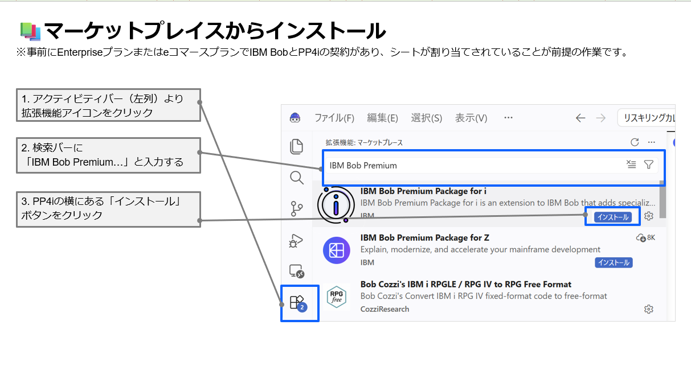
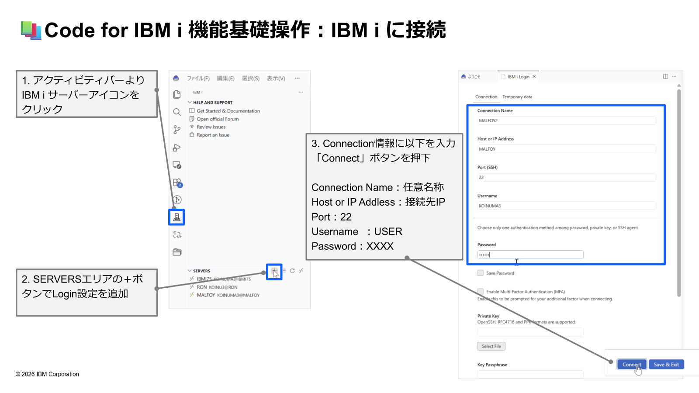
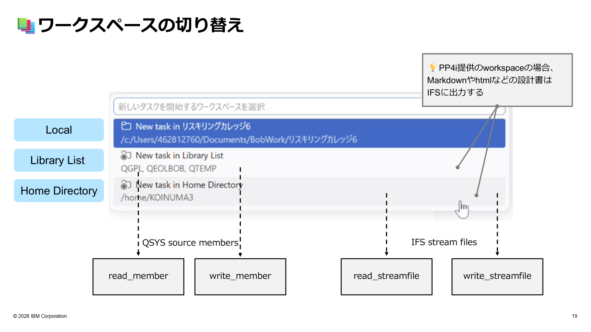
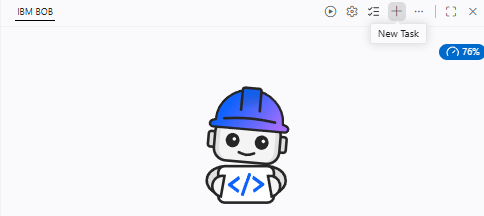
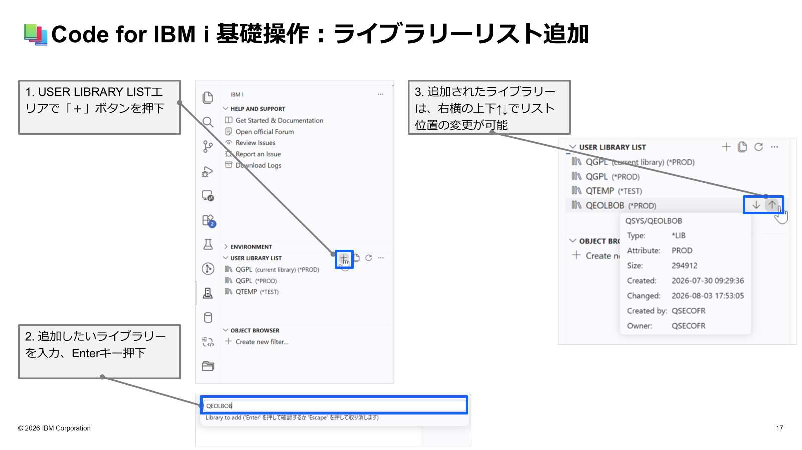
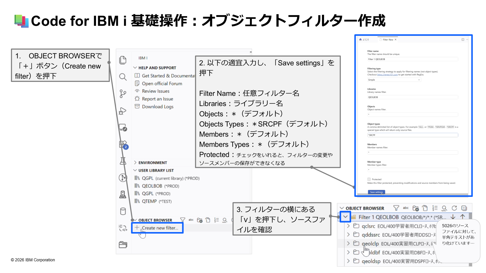
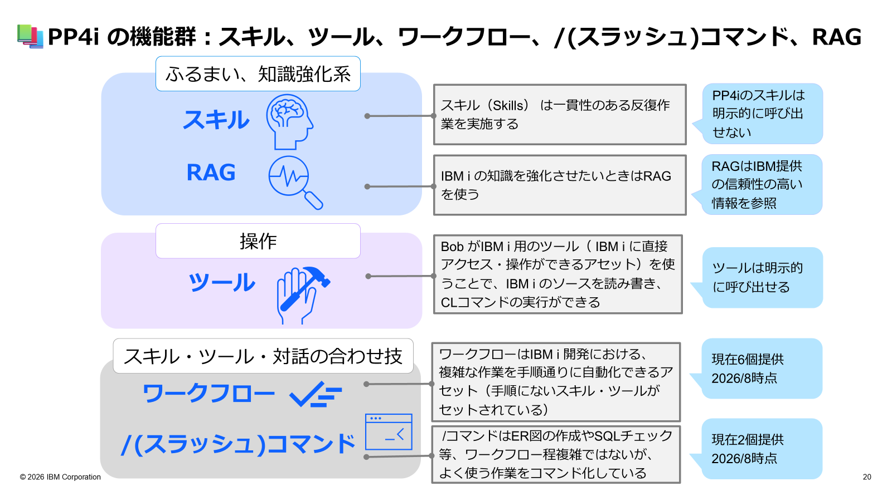

> 🚧 **このラボは現在作成中です。内容は予告なく変更される場合があります。**

# LAB1-PP4i: IBM Bob Premium Package for i 基本操作 🚀

## 🎯 このラボの目標

IBM Bob Premium Package for i（PP4i）をインストールし、IBM i への接続・ライブラリーリスト設定・オブジェクトブラウザーの操作という**PP4i固有の基本操作**を習得します。最後にスキル・ツール・RAGを組み合わせて、**HTML形式の内部設計書を自動生成**することでPP4iの真価を体験します。

**所要時間**: 20-25分  
**難易度**: ★★☆☆☆（初中級）  
**使用モード**: IBM i Developer モード  
**ワークスペース**: Local

---

## 📚 学習内容

このラボでは、以下のスキルを習得します：

- ✅ PP4iのインストール手順
- ✅ Code for IBM i を使ったIBM i への接続
- ✅ ワークスペースの種類と使い分け
- ✅ ライブラリーリストの追加・管理
- ✅ オブジェクトフィルターの作成
- ✅ **スキル・ツール・RAGを組み合わせたHTML内部設計書の生成**

---

## 🛠️ ステップ0: QEOLライブラリーのインストール（3分）

> 💡 **このステップの目的**: ハンズオン用サンプルライブラリー `QEOL` を IBM i にリストアします。

### 0.1 QEOLライブラリーのダウンロードとリストア

ハンズオン用サンプルライブラリー `QEOL` は IBM Community からダウンロードします。

🔗 **[IBM i QEOL ダウンロード](https://community.ibm.com/community/user/viewdocument/ibm-i-qeol?CommunityKey=2bf1e52c-a706-482b-86e8-018e81a19ab5&tab=librarydocuments)**

> ⚠️ **IBM i システムへのリストア手順**については、上記ダウンロードページの説明を参照してください。

> ✅ **確認**: `QEOL` ライブラリーがリストアされたことを確認してください。

---

## ステップ1: PP4iのインストール（3分）

> 💡 **前提**: IBM BobのEnterpriseプランまたはeコマースプランでPP4iのシートが割り当てられていることが必要です。

### 1.1 マーケットプレイスからインストール

1. **アクティビティバー**（左列）の **拡張機能アイコン** をクリック
2. 検索バーに **`IBM Bob Premium Package for i`** と入力
3. PP4i の横にある **「インストール」** ボタンをクリック



インストールが完了すると、以下の拡張機能が自動的に追加されます：

| 拡張機能 | 最低バージョン |
|---------|-------------|
| Code for IBM i | 3.0.10 |
| Db2 for IBM i | 2.0.1 |
| RPGLE | 0.33.7 |
| CLLE | 1.2.6 |
| IBM i Testing | 1.3.4 |
| IBMi Languages | 0.6.25 |

💡 **ヒント**: 拡張機能等PP4iの前提条件は[公式ドキュメント](https://bob.ibm.com/ja/docs/ide/premium-packages/bob-for-i/prerequisites)を参照してください。

---

## ステップ2: IBM i への接続（5分）

### 2.1 接続設定の追加

> ⚠️ **IBM i 側の前提条件**:
> - IBM i 7.4 以降
>   - IBM i 7.4 の特定要件 – SF99704 – レベル 13 以上
> - SSHデーモンが起動していること（`STRTCPSVR *SSHD`）
> - ライセンス・プログラム `5733-SC1` がインストール済み
> - ユーザー `QSSHD` が有効化されていること

1. **アクティビティバー**より **IBM i サーバーアイコン** をクリック
2. **SERVERS エリア**の **「＋」ボタン** でLogin設定を追加
3. 以下の接続情報を入力し、**「Connect」ボタン** を押下

| 項目 | 入力値 |
|-----|-------|
| Connection Name | 任意の名前（例：`IBMI-DEV`） |
| Host or IP Address | 接続先IPアドレス |
| Port | `22`（SSH） |
| Username | IBMiユーザー名 |
| Password | パスワード |



---

## 🔄 ステップ3: ワークスペースの切り替え（2分）

PP4iでは、以下の3つのワークスペースを使い分けられます：

| ワークスペース | 対象 | 主な用途 |
|-------------|------|---------|
| **Local**  | ローカルPC | 通常の開発・設計書のHTML出力、IBM i 上のRPG/CLソースの直接読み書きも可能 |
| **Library List** | QSYS ソースメンバー | IBM i 上のライブラリーを指定したRPG/CLソースの直接読み書きが可能 |
| **Home Directory** | IFS ストリームファイル | IFSへのファイル操作 |



> 💡 **このラボではLocalワークスペースを使用します。**
> HTMLファイルはローカルに出力されるため、Bobのビューアー機能でそのまま確認できます。
> Library List / Home Directory ワークスペースを使用する場合は、Code for IBM i 経由での有効なIBM i 接続が必要です。

### 3.1 ワークスペースの切り替え手順

1. チャット入力欄の上部にある **New Task** をクリック
   1. 
2. 一番上部にある **「Local＝PCのワークスペース」** を選択

---

## 📚 ステップ4: ライブラリーリストの追加（3分）

### 4.1 STUDYxxライブラリーへの複製（Bobに指示して実行）

まず `QEOL` を **各自の作業ライブラリー `STUDYxx`** として複製しましょう。Bob に自然言語で指示するだけで、適切なCLコマンドを生成・実行してくれます。

> ⚠️ **事前準備**: CL コマンドを実行するため、**チャットウィンドウ左下のモード選択から「IBM i Developer」モードを選択**してください。

#### Bob への指示例

チャット入力欄に、以下のように入力してください（`xx` は自分の番号に置き換えてください）：

```
QEOL ライブラリーを STUDYXX という名前で複製してください。
CPYLIB コマンドを使って、すべてのオブジェクトをコピーしてください。
```

#### Bob が生成・実行するコマンド（例）

Bob は以下のようなCLコマンドを提案・実行します：

```cl
CPYLIB FROMLIB(QEOL) TOLIB(STUDY01) CRTLIB(*YES) COPYOPT(*ALL)
```

| パラメーター | 値 | 説明 |
|------------|---|------|
| `FROMLIB` | `QEOL` | コピー元ライブラリー |
| `TOLIB` | `STUDYxx` | コピー先ライブラリー（各自の番号） |
| `CRTLIB` | `*YES` | コピー先ライブラリーが存在しない場合は自動作成 |
| `COPYOPT` | `*ALL` | すべてのオブジェクトをコピー |

> 💡 **ポイント**: BobはIBM i Developer モードでCLコマンドを直接実行できます。「実行してください」と伝えることで、コマンドの生成から実行まで一気に行えます。

> ✅ **確認**: `STUDYxx` ライブラリーが作成され、`QEOL` と同じオブジェクトが含まれていることをオブジェクトブラウザーで確認してください。

---

### 4.2 ライブラリーリストへの追加手順

複製した `STUDYxx` をライブラリーリストに追加します。

1. **USER LIBRARY LIST エリア**で **「＋」ボタン** を押下
2. **`STUDYxx`**（自分の番号）を入力し、**Enter キー** を押下
3. 追加されたライブラリーは、右横の **↑↓ ボタン** でリスト位置を変更可能


>⚠️ **追加するライブラリー**: 上記スクリーンショットでは`QEOLBOB`を指定していますが、**3.1で複製した `STUDYxx`（自分の番号）** を指定してください。

💡 **ヒント**: ライブラリーリストの順番はプログラム検索順に影響します。よく使うライブラリーを上位に設定しましょう。

---

## 🔍 ステップ5: オブジェクトフィルターの作成（3分）

### 5.1 フィルターの作成

1. **OBJECT BROWSER** で **「＋」ボタン**（Create new filter）を押下
2. 以下の情報を入力し、**「Save settings」** を押下

| 項目 | 入力例 | 説明 |
|-----|-------|-----|
| Filter Name | `STUDYxx-SRC` | 任意のフィルター名 |
| Libraries | `STUDYxx` | 対象ライブラリー名（自分の番号） |
| Objects | `*` | すべてのオブジェクト |
| Objects Types | `*SRCPF` | ソース物理ファイル |
| Members | `*` | すべてのメンバー |
| Members Types | `*` | すべてのメンバータイプ |
| Protected | チェックなし | 変更・保存を許可 |

3. フィルターの横にある **「∨」** を押下し、ソースファイルを展開して確認



>⚠️ **追加するライブラリー**: 上記スクリーンショットでは`QEOLBOB`でオブジェクトフィルターを作成していますが、**4.1で複製した `STUDYxx`（自分の番号）** を指定してください。

---

## 📄 ステップ6: HTML内部設計書を生成する（7分）

PP4iの**スキル・ツール・RAG**を組み合わせた実践として、既存のRPGプログラムからHTML形式の内部設計書を自動生成します。

> 💡 **なぜこれがPP4iの真価なのか？**
> - **スキル**: IBM i Developer モードのRPG/DDS専門知識で高精度な解析
> - **ツール**: `read_member` でIBM i から直接ソースを取得（Base Bobでは使用不可）
> - **RAG**: IBM i 公式ドキュメントを根拠にした正確な仕様説明
> この3つが組み合わさることで、Base Bobでは難しい高品質な設計書が生成されます。



### 6.1 IBM i Developer モードを選択

1. **チャットウィンドウ左下**のモード選択から **「IBM i Developer」** モードを選択

### 6.2 内部設計書の生成を依頼

以下のプロンプトをそのままBobに貼り付けて実行してください：

**Bobへの依頼例**:
```
STUDYxx/QEOLRPG の iph210 メンバーを読み込んで、以下の形式で仕様書を作成してください。
RPG、DSPF、DDS に関するスキルを参照してください。
IBM i のドキュメントを調査するときは RAG を使用してください。
フロー図はグラフィカルに表現してください。

【形式】
1. プログラム概要（目的・処理の全体像）
2. 入力（パラメータ・呼び出し元・使用ファイル一覧）
3. 出力（更新・作成するファイル・戻り値）
4. 主要処理フロー（番号付き手順）
5. エラー処理・例外条件
6. 他プログラム／サービスプログラムとの依存関係

出力は html 形式で出力してください。
htmlの確認はBobのビューアー機能で手動で行います。
```

> 💡 **ポイント**: DDSファイル（`iph210s`）は明示的に指定しなくても、BobがRPGソースのF仕様書を解析して自動的に関連ファイルを参照しに行きます。

### 6.3 生成結果の確認

**期待される動作**:
1. `read_member` ツールがIBM i から `iph210`（RPGプログラム）を直接取得
2. IBM i Developer モードのRPG・DDSスキルが解析を実行（関連DDSも自動参照）
3. RAGがRPG III・サブファイル仕様を公式ドキュメントから参照
4. SVGフローチャート付きのHTML設計書を `iph210_design.html` として生成

**生成される設計書の主な内容（例）**:

| セクション | 内容例 |
|-----------|--------|
| プログラム概要 | IPH210 / 得意先照会プログラム（対話型） |
| 入力ファイル | TOKMSL02（得意先マスター論理ファイル）、IPH210S（画面ファイル） |
| 出力 | サブファイルへの表示（PANEL80/PANEL90） |
| 処理フロー | SVGグラフ：入力→検索→サブファイル構築→表示→終了の流れ |
| 画面レイアウト | PANEL80（明細）・PANEL90（制御）の項目と配置 |
| エラー処理 | レコード未検出（*IN30）、ファイル終了（*IN50）の処理 |

💡 **確認方法**: 生成された `.html` ファイルをエクスプローラーで右クリック → **「Open with Bob Viewer」** でプレビュー確認

### 6.4 派生：RAGを使って命令の仕様を調べる（オプション）

設計書の生成後、コード中に出てくる演算命令の意味をRAGで調べてみましょう。PP4iのRAGが**IBM i 公式ドキュメントを根拠に**正確に答えてくれることを確認できます。

**Bobへの質問例**:
```
iph210 の中に出てくる SETLL 命令は何をする命令ですか？
RAG を使って調べてください。
```

```
DOWEQ と DOUEQ の違いを RAG を使って説明してください。
```

```
*IN30 のような標識（インジケーター）の仕組みを
RAG を使って説明してください。
```

**RAGあり・なしの違い**:
- RAGなし: LLMの学習データに依存するため、古い仕様や固有の挙動で誤答のリスクあり
- RAGあり: IBM i マニュアル・Redbookの該当箇所を根拠にした正確な回答

> 💡 **活用ヒント**: Rulesに以下を書いておくと、毎回「RAGを使って」と指定しなくても自動で参照されます。
> ```markdown
> ## IBM i ドキュメントツールの活用
> IBM i の仕様について確認が必要な場合は、
> 推測する前に必ず RAG を使用すること。
> ```

---

## ✅ チェックポイント

このラボを完了したら、以下を確認してください：

- [ ] QEOLライブラリーがIBM i にリストアされた
- [ ] PP4iがインストールされた
- [ ] IBM i に SSH 接続できた
- [ ] ワークスペースを Local に設定した
- [ ] BobへのCLコマンド指示で `STUDYxx` ライブラリーが複製された
- [ ] ライブラリーリストに `STUDYxx` を追加できた
- [ ] オブジェクトフィルターを作成してソースを確認できた
- [ ] HTML内部設計書が生成できた
- [ ] スキル・ツール・RAGが連携して動作することを確認した

---

## 💡 このラボで学んだこと

### IBM Bob PP4iでできたこと

✅ **IBM i に直接接続して開発できる**
- ローカルにダウンロード不要
- QSYS ソースメンバーを直接読み書き（`read_member` / `write_member`）
- コピー＆ペースト不要のシームレスな開発

✅ **スキル・ツール・RAGの組み合わせで高品質な成果物**
- RPG/DDSの専門スキルが自動適用
- `read_member` でIBM i から直接取得
- 公式ドキュメントに基づく正確な仕様説明

✅ **HTML設計書を自動生成**
- SVGフローチャート付きの見やすい設計書
- ブラウザやBobビューアーで即確認・共有可能

### Base Bob と PP4i の違い

| 機能 | Base Bob | PP4i |
|-----|---------|------|
| IBM i への直接接続 | ❌ | ✅ |
| ソースの直接読み書き | ❌ | ✅ |
| IBM i 専門スキル | 限定的 | ✅ 約20種 |
| ワークフロー | ❌ | ✅ |
| /(スラッシュ)コマンド | 標準のみ | ✅ IBM i 専用追加 |
| RAG（公式ドキュメント） | ❌ | ✅ |

---

## 🎉 ラボ完了！

お疲れ様でした！PP4iの基本操作とHTML設計書生成をマスターしました。

### 次のステップ

準備ができたら、次のラボに進みましょう：

👉 **[LAB2-PP4i: ソース改修・テストを体験](./LAB2-PP4i.md)** - RPGソースの改修・コンパイル・RPGUnitテストを体験します

---

**前のページ**: [LAB3-FIX](./LAB3-FIX.md) | **次のページ**: [LAB2-PP4i](./LAB2-PP4i.md)
