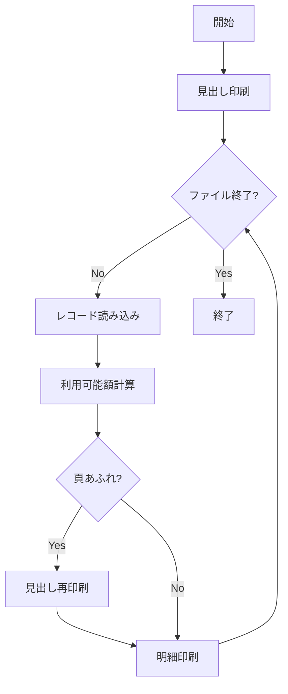

# LAB1: 既存プログラムの理解 📖

## 🎯 このラボの目標

IBM Bobを使って、既存のRPG IIIバッチプログラムを理解する方法を学びます。プログラムの動作理解、ドキュメント化、可視化のスキルを習得します。

**所要時間**: 15-20分
**難易度**: ★☆☆☆☆（初級）
**使用モード**: Ask モード（質問中心）→ Code モード（コード生成時）

---

## 📚 学習内容

このラボでは、以下のスキルを習得します：

- ✅ IBM Bobへの効果的な質問方法
- ✅ プログラム全体の概要把握
- ✅ ファイル定義の理解
- ✅ 処理ロジックの詳細解析
- ✅ フローチャートの自動生成
- ✅ コメントの自動追加

---

## 🚀 ステップ1: 事前準備（2分）

### 1.1 プロジェクトを開く

1. **Bob IDEを起動**します
2. **ワークスペースを開く**
   - `File` → `Open Folder...`
   - `1_ibmi-hands-on-JPAN-TechSales` フォルダを選択

### 1.2 対象ファイルを開く

1. **エクスプローラーエリア**（左側のファイル一覧）で以下のファイルを探します：
   ```
   QEOL400/QEOLRPG/bch110.rpg
   ```

2. **ファイルをクリック**して開きます

💡 **このファイルについて**: 得意先マスター一覧表を印刷するバッチプログラムです。これから、このプログラムの動作を理解していきます。

### 1.3 Ask モードを選択

1. **チャットウィンドウの左下**から**Ask モード**を選択します（質問中心のため）


2. `bch110.rpg`ファイルが開かれていることを確認します

💡 **ヒント**: このラボでは主にAsk モードを使用します。コード生成が必要な場合（ステップ4以降）は、Code モードに切り替えることもできます。

---

## 💡 ステップ2: プログラム全体の理解（5分）

### 2.1 プログラムの概要を聞く

まず、プログラムが何をするのか、全体像を把握しましょう。

**Bobへの質問例**:
```
QEOL400/QEOLRPG/bch110.rpgは何をするプログラムですか？
処理の流れを簡潔に説明してください。
```

**期待される回答のポイント**:
- 得意先マスター一覧表を印刷するバッチプログラム
- ファイルを順次読み込み
- 利用可能額を計算
- 印刷出力

💡 **ヒント**: Bobの回答をコピーして、ドキュメントとして保存できます。

### 2.2 ファイル定義の説明を聞く

次に、プログラムで使用しているファイルを理解しましょう。

**Bobへの質問例**:
```
このプログラムで使用しているファイルを説明してください。
特にF仕様書の各パラメータの意味を教えてください。
```

**期待される回答のポイント**:
- TOKMSL03: 入力ファイル（得意先マスター）
- QPRINT: 出力ファイル（印刷）
- I/O/F/E/Kなどの指定の意味

---

## 🔍 ステップ3: 処理ロジックの詳細理解（5分）

### 3.1 メインループの説明

プログラムの中心となる処理ループを理解しましょう。

**Bobへの質問例**:
```
8行目から22行目のメインループ処理を詳しく説明してください。
特に標識99の役割と、DOWEQの動作を教えてください。
```

**期待される回答のポイント**:
- DOWEQ: DO WHILE EQUALの意味
- *IN99: ファイル終了標識
- ループの継続条件

### 3.2 計算処理の説明

業務ロジックの核心部分を理解しましょう。

**Bobへの質問例**:
```
15行目の計算式を説明してください。
C           TKGEND    SUB  TKUZAN    WKRIYO  90
この計算の業務的な意味は何ですか？
```

**期待される回答のポイント**:
- TKGEND（信用限度額）からTKUZAN（売掛金残高）を引いてWKRIYO（利用可能額）を計算
- 標識90の役割（負の値の検出）
- 業務ロジックの説明

### 3.3 印刷処理の説明

出力処理の仕組みを理解しましょう。

**Bobへの質問例**:
```
出力仕様書（O仕様）の構造を説明してください。
MIDASIとMEISAIの違いは何ですか？
```

**期待される回答のポイント**:
- EXCPT命令による出力
- 見出し行と明細行の違い
- 頁あふれ（OF）の処理

---

## 📊 ステップ4: コードの可視化（3分）

💡 **モード切り替え**: ここからはコード生成を行うため、**Code モード**に切り替えましょう。

### 4.1 フローチャートの生成とMarkdownファイル出力

処理の流れを視覚的に理解し、ドキュメントとして保存しましょう。

**手順**:

1. **Code モードに切り替え**
   - **チャットウィンドウの左下**から「Code」モードを選択

2. **Bobへの依頼**:
```
このプログラム（bch110.rpg）の処理フローをMermaid形式のフローチャートで表現し、
「bch110_flowchart.md」というMarkdownファイルに出力してください。
ファイルには以下を含めてください：
- プログラム名と説明
- Mermaidフローチャート
- 各処理ステップの簡単な説明
```

3. **生成されるファイルの例**:

**bch110_flowchart.md**:
```markdown
# BCH110 処理フロー

## プログラム概要
得意先マスター一覧表を印刷するバッチプログラム

## 処理フロー



## 処理ステップ説明
1. 見出し印刷: レポートのヘッダーを出力
2. レコード読み込み: 得意先マスターから1件ずつ読み込み
3. 利用可能額計算: 信用限度額 - 売掛金残高
4. 明細印刷: 計算結果を出力
```

💡 **ヒント**: 生成されたMarkdownファイルをプレビューする方法
- **Bob IDE**: 標準でMermaidをサポート（そのままプレビュー可能）
- **VS Code**: 以下の拡張機能をインストールしてください
  - "Markdown Preview Mermaid Support" または
  - "Markdown All in One"（Mermaid対応版）

### 4.2 コメントの追加

コードの可読性を向上させましょう。

**Bobへの質問例**:
```
このプログラムに日本語のコメントを追加してください。
特に初心者が理解しやすいように、各セクションの役割を説明するコメントをお願いします。
```

💡 **ヒント**: Bobが生成したコメント付きコードを、元のコードと比較してみましょう。

---

## 🎓 ステップ5: 実践的な質問（オプション）

時間に余裕がある場合、以下の質問も試してみましょう：

### 質問例1: エラー処理の確認
```
このプログラムにエラー処理は実装されていますか？
もし不足している場合、どのようなエラー処理を追加すべきですか？
```

### 質問例2: パフォーマンスの確認
```
このプログラムのパフォーマンスを改善する方法はありますか？
```

### 質問例3: モダナイゼーション
```
このRPG IIIプログラムをRPG IVに変換するとどうなりますか？
主な変更点を教えてください。
```

---

## ✅ チェックポイント

このラボを完了したら、以下を確認してください：

- [ ] プログラムの目的と処理フローを説明できる
- [ ] 使用しているファイルとその役割を理解している
- [ ] 主要な計算ロジックを説明できる
- [ ] フローチャートを生成できた
- [ ] Bobへの効果的な質問方法を理解した

---

## 💡 このラボで学んだこと

### IBM Bobでできたこと

✅ **コードの理解が劇的に早くなる**
- 従来: マニュアルを読んで、コードを1行ずつ解析（数時間～数日）
- Bob活用: 自然言語で質問して、即座に回答を得る（数分）

✅ **ドキュメント作成が自動化できる**
- プログラム仕様書の自動生成
- フローチャートの自動生成
- コメントの自動追加

✅ **学習コストが下がる**
- RPG IIIを知らなくても理解できる
- 業務ロジックに集中できる

### 実務での活用シーン

1. **既存プログラムの理解と引き継ぎ**
   - 前任者が作成したコードの理解
   - 長年稼働しているシステムの保守
   - ドキュメントが不足しているコードの解析

2. **新人教育とチーム支援**
   - 既存システムの学習教材作成
   - コードレビューの効率化
   - 技術的な質問への即答

3. **ドキュメント作成と知識共有**
   - 仕様書の自動生成
   - 保守マニュアルの作成
   - 技術資料の整備

---

## 🎯 よくある質問

**Q1: Bobの回答が間違っている場合は？**

A: 「その説明は正しくないようです。もう一度確認してください」と再質問してください。より具体的な情報を追加して質問し直すと、精度が向上します。

**Q2: Bobが理解できない質問をした場合は？**

A: 質問を分解して、段階的に聞きましょう。コードの該当箇所を明示すると、より正確な回答が得られます。

**Q3: 複雑な処理の説明を求めるには？**

A: まず全体像を聞き、次に詳細を段階的に質問する方法が効果的です。

---

## 📝 質問テンプレート集

### プログラム理解用
```
- このプログラムの目的は何ですか？
- 主な処理フローを説明してください
- 使用しているファイルを列挙してください
- エラー処理はどのように実装されていますか？
```

### コード解析用
```
- X行目からY行目の処理を説明してください
- この標識の役割は何ですか？
- この計算式の意味を教えてください
- このファイル定義のパラメータを説明してください
```

### ドキュメント生成用
```
- このプログラムの仕様書を作成してください
- 処理フローをフローチャートで表現してください
- 各セクションにコメントを追加してください
- データ項目の一覧表を作成してください
```

---

## 🎉 ラボ完了！

お疲れ様でした！IBM Bobを使って既存プログラムを理解する方法を学びました。

### 次のステップ

準備ができたら、次のラボに進みましょう：

👉 **[LAB2: プログラムの修正](./LAB2.md)** - 既存プログラムに新しい項目を追加する方法を学びます

---

**前のページ**: [README](./README.md) | **次のページ**: [LAB2](./LAB2.md)