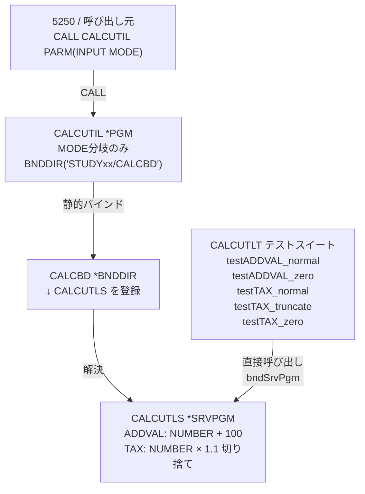

> 🚧 **このラボは現在作成中です。内容は予告なく変更される場合があります。**

# LAB2-PP4i: PP4iでソース改修・テストを体験 🔧

## 🎯 このラボの目標

PP4iを使って IBM i 上のRPGLEソースを**Bobへの自然言語指示で改修**し、**コンパイル**して**RPGUnitでテスト**する、一連の開発サイクルを体験します。

**所要時間**: 25-30分  
**難易度**: ★★★☆☆（中級）  
**使用モード**: IBM i Developer モード  
**ワークスペース**: Library List

---

## 📚 学習内容

このラボでは、以下のスキルを習得します：

- ✅ `read_member` でIBM i からソースを直接読み込み
- ✅ Bobへの自然言語指示によるRPGLEソース改修
- ✅ `write_member` でIBM i に直接書き戻し
- ✅ `execute_compile_action` によるコンパイル
- ✅ ILE の **サービスプログラム**・**バインディングディレクトリー**の概念
- ✅ **RPGUnit** によるユニットテストの生成と実行

---

## 📋 このラボで使うソース

このラボでは2本のRPGLEソースを使います。

### CALCUTLS（サービスプログラム）

計算ロジックを持つサービスプログラムです。`ADDVAL`・`TAX` の2つのプロシージャーを `EXPORT` します。

```rpgle
     H NOMAIN
     H*****************************************************************
     H* CALCUTLS - 計算ユーティリティ サービスプログラム
     H*****************************************************************
     P ADDVAL          B                   EXPORT
     D ADDVAL          PI             9S 0
     D  NUMBER                        9S 0 CONST
     C*
     C                   RETURN    NUMBER + 100
     P ADDVAL          E
     P TAX             B                   EXPORT
     D TAX             PI             9S 0
     D  NUMBER                        9S 0 CONST
     D  WORK           S             11P 1
     C*
     C                   EVAL      WORK = NUMBER * 1.1
     C                   RETURN    %INT(WORK)
     P TAX             E
```

> 💡 **パラメーター型は `9S 0`（ゾーン）を使用**: ゾーン型は5250の `CALL` コマンドから `PARM('000000100')` のように文字列で自然に渡せるため扱いやすいです。フリーフォームのテストスイートでは `9S 0` の `S` がCCSID 5026環境で文字化けするため、`zoned(9:0)` と記述します。

### CALCUTIL（メインプログラム）

`MODE` パラメーターで処理を分岐し、`CALCUTLS` のプロシージャーを呼び出すメインプログラムです。バインディングディレクトリー `CALCBD` 経由で `CALCUTLS` に静的バインドします。

```rpgle
     H DFTACTGRP(*NO) ACTGRP(*CALLER)
     H BNDDIR('STUDYxx/CALCBD')
     H*****************************************************************
     H* CALCUTIL - 計算ユーティリティ メインプログラム
     H*****************************************************************
     D* プロトタイプの定義（CALCUTLS のプロシージャー）
     D ADDVAL          PR             9P 0
     D  NUMBER                        9P 0 CONST
     D TAX             PR             9P 0
     D  NUMBER                        9P 0 CONST
     D* 変数の定義
     D RESULT          S              9P 0
     D INPUT           S              9P 0
     D MODE            S              1S 0
     C     *ENTRY        PLIST
     C                   PARM                    INPUT
     C                   PARM                    MODE
     C                   IF        MODE = 0
     C                   EVAL      RESULT = ADDVAL(INPUT)
     C                   ELSE
     C                   EVAL      RESULT = TAX(INPUT)
     C                   ENDIF
     C                   DSPLY                   RESULT
     C                   SETON                                        LR
     C                   RETURN
```

**オブジェクト構成と呼び出し関係**:



**ポイント**:
- `CALCUTLS`：`NOMAIN` + プロシージャーを `EXPORT` → RPGUnit から直接呼び出し可能
- `CALCUTIL`：分岐ロジックのみ、`BNDDIR` で `CALCUTLS` に**静的バインド**
- `CALCBD`：バインディングディレクトリー。`CALCUTLS` を登録しておくことで `CALCUTIL` がバインド先を解決する
- **改修は `CALCUTLS` だけ**：`CALCUTIL` の再コンパイルなしに計算ロジックを差し替えられる

---

## 🛠️ 事前準備: ソースの作成とコンパイル（8分）

### 準備1: ワークスペースを Library List に切り替え、ライブラリーリストを確認する

1. チャット入力欄の上部にある **New Task** をクリック
2. **「Library List」** を選択
3. 以下のライブラリーが含まれていることを確認

| ライブラリー | 用途 |
|------------|------|
| `STUDYxx` | ソースメンバーの格納先（`xx` は割り当てられた自分の番号） |
| `RPGUNIT` | RPGUnit テストフレームワーク |

> 💡 **`STUDYxx` について**: `xx` はハンズオン参加者ごとに割り当てられた番号です。例：`STUDY01`、`STUDY02` など。LAB1 で複製した自分の `STUDYxx` ライブラリーを使用します。

> ⚠️ **`RPGUNIT` がリストにない場合**: IBM i の接続設定（Library List）に `RPGUNIT` を追加してください。RPGUnit テスト（ステップ3）の実行時に必要です。

### 準備2: IBM i Developer モードを選択

- **チャットウィンドウ左下**のモード選択から **「IBM i Developer」** モードを選択

### 準備3: ソースの作成・コンパイル・バインディングディレクトリーの設定

以下のプロンプトをそのままBobに貼り付けてください（`xx` は自分の番号）：

```
以下の手順をすべて実行してください。

【1】STUDYxx/QEOLRPGLE に CALCUTLS メンバーを作成して以下のソースを書き込み、
    モジュールを作成（CRTRPGMOD）してからサービスプログラム（CRTSRVPGM）を作成してください。
    CRTSRVPGM のパラメーター: EXPORT(*ALL) ACTGRP(*CALLER)

     H NOMAIN
     H*****************************************************************
     H* CALCUTLS - 計算ユーティリティ サービスプログラム
     H*****************************************************************
     P ADDVAL          B                   EXPORT
     D ADDVAL          PI             9S 0
     D  NUMBER                        9S 0 CONST
     C*
     C                   RETURN    NUMBER + 100
     P ADDVAL          E
     P TAX             B                   EXPORT
     D TAX             PI             9S 0
     D  NUMBER                        9S 0 CONST
     D  WORK           S             11S 1
     C*
     C                   EVAL      WORK = NUMBER * 1.1
     C                   RETURN    %INT(WORK)
     P TAX             E

【2】バインディングディレクトリー STUDYxx/CALCBD を作成し、
    CALCUTLS (*SRVPGM) を登録してください。

【3】STUDYxx/QEOLRPGLE に CALCUTIL メンバーを作成して以下のソースを書き込み、
    CRTBNDRPG でコンパイルしてください。

     H DFTACTGRP(*NO) ACTGRP(*CALLER)
     H BNDDIR('STUDYxx/CALCBD')
     H*****************************************************************
     H* CALCUTIL - 計算ユーティリティ メインプログラム
     H*****************************************************************
     D* プロトタイプの定義（CALCUTLS のプロシージャー）
     D ADDVAL          PR             9S 0
     D  NUMBER                        9S 0 CONST
     D TAX             PR             9S 0
     D  NUMBER                        9S 0 CONST
     D* 変数の定義
     D RESULT          S              9S 0
     D INPUT           S              9S 0
     D MODE            S              1S 0
     C     *ENTRY        PLIST
     C                   PARM                    INPUT
     C                   PARM                    MODE
     C                   IF        MODE = 0
     C                   EVAL      RESULT = ADDVAL(INPUT)
     C                   ELSE
     C                   EVAL      RESULT = TAX(INPUT)
     C                   ENDIF
     C                   DSPLY                   RESULT
     C                   SETON                                        LR
     C                   RETURN
```

**期待される動作**:
1. `write_member` で `CALCUTLS` ソースを書き込み
2. `CRTRPGMOD` → `CRTSRVPGM` で `*SRVPGM` 作成
3. `CRTBNDDIR` + `ADDBNDDIRE` でバインディングディレクトリー設定
4. `write_member` で `CALCUTIL` ソースを書き込み
5. `CRTBNDRPG` で `*PGM` 作成

> ✅ **確認**: すべて正常終了したことを確認してから次のステップへ進んでください。

### 準備4: 5250でプログラムを呼び出して動作確認する

コンパイルが完了したら、5250エミュレーターで以下を実行して動作を確認します（`xx` は自分の番号）：

**MODE=0: 加算モード（100 + 100 = 200）**
```
CALL PGM(STUDYxx/CALCUTIL) PARM('000000100' '0')
```
```
DSPLY  0000000200
```

**MODE=1: 消費税モード（1000 × 1.1 = 1100）**
```
CALL PGM(STUDYxx/CALCUTIL) PARM('000001000' '1')
```
```
DSPLY  0000001100
```

**MODE=1: 小数切り捨て確認（1050 × 1.1 = 1155）**
```
CALL PGM(STUDYxx/CALCUTIL) PARM('000001050' '1')
```
```
DSPLY  0000001155
```

> 💡 **ポイント**: 3番目のパターンで小数点以下が切り捨てられることを確認できます（1050 × 1.1 = 1155.0 → 1155）。

> ✅ **確認**: 3パターンすべて期待通りに表示されたことを確認してから次のステップへ進んでください。

---

## ステップ1: ソースを読んで内容を確認する（3分）

改修前に対象ソースの内容をBobに読み込ませ、現状を把握します。

以下のプロンプトをBobに貼り付けてください：

```
STUDYXX/QEOLRPGLE の CALCUTLS と CALCUTIL メンバーを読み込んで、
2つのプログラムの役割と関係を日本語で説明してください。
```

**期待される動作**:
1. `read_member` ツールが `CALCUTLS`・`CALCUTIL` を IBM i から直接取得
2. IBM i Developer モードのRPGスキルが解析
3. サービスプログラムとメインプログラムの役割・静的バインドの関係を日本語で説明

---

## ステップ2: ソースを改修する（7分）

`CALCUTLS` の `TAX` プロシージャーを改修します。  
以下のプロンプトをそのままBobに貼り付けてください：

```
STUDYXX/QEOLRPGLE/CALCUTLS.RPGLE を以下の仕様で改修して、
サービスプログラムの再作成（CRTRPGMOD → CRTSRVPGM）まで実施してください。

【改修仕様】
1. TAX プロシージャーの消費税率を 1.1 から 1.08 に変更する
   （税率8%への変更）

2. ADDVAL プロシージャーはそのまま（NUMBER + 100 を返す）
```

**期待される動作**:
1. Bobが改修仕様を解析して `CALCUTLS` ソースを編集
2. `write_member` ツールで IBM i のソースメンバーに直接書き戻し
3. `CRTRPGMOD` → `CRTSRVPGM` でサービスプログラムを再作成

> 💡 **ポイント**: `CALCUTIL`（`*PGM`）は変更不要です。サービスプログラム（`CALCUTLS`）だけ差し替えれば、呼び出し側の `CALCUTIL` は変更なく新しい計算ロジックを使えます。これが**サービスプログラム分離のメリット**です。

> ✅ **確認**: コンパイルが正常終了したことを確認してから次のステップへ進んでください。

### 動作確認（5250）

改修後、5250エミュレーターで以下を実行して税率変更を確認します（`xx` は自分の番号）：

**MODE=1: 消費税モード（1000 × 1.08 = 1080）**
```
CALL PGM(STUDYxx/CALCUTIL) PARM('000001000' '1')
```
```
DSPLY  0000001080
```

> ✅ **確認**: 改修前の `1100` から `1080` に変わっていることを確認してください。

---

## ステップ3: RPGUnit でテストする（7分）

### 3.1 テストスイートの作成をBobに依頼

以下のプロンプトをBobに貼り付けてください：

```
STUDYXX/QEOLRPGLE の CALCUTLS に対する RPGUnit テストスイートを生成して、
STUDYxx/QTESTSRC/CALCUTLT に書き込んでください。
QTESTSRC ソースファイルがなければ RCDLEN(112) IGCDTA(*YES) で作成してください。
テストケースは以下の5件を含めてください：
- testADDVAL_normal : ADDVAL(100) → 200
- testADDVAL_zero   : ADDVAL(0)   → 100
- testTAX_normal    : TAX(1000)   → 1100
- testTAX_truncate  : TAX(1050)   → 1155
- testTAX_zero      : TAX(0)      → 0
パラメーターの型は zoned(9:0) を使用してください。
```

**期待される動作**:
1. `read_member` で `CALCUTLS` を取得してプロシージャー定義を解析
2. `generate_rpg_unit_test_stub` でテストスタブを生成
3. 5件のテストケースを含むソースを `write_member` で書き込み

> ⚠️ **`zoned(9:0)` を使う理由**: フリーフォーマットRPGLEで `9S 0` と書くと、CCSID 5026環境でコンパイル時に `S` が文字化けし `CPF427D` エラーになります。フリーフォームでは `zoned(9:0)` と記述することで同じゾーン型を安全に指定できます。

> 💡 **`CRTSRCPF` のポイント**:
> - **`RCDLEN(112)`**: シーケンス番号(6)＋日付(6)＋ソースデータ(100)の合計。Free形式RPGLEは100桁必要なため、デフォルト(92)では行が切れてコンパイルエラーになります。
> - **`IGCDTA(*YES)`**: 日本語環境でDBCS（全角）文字をソース内で使用する場合に必要です。

### 3.2 testing.json の配置をBobに依頼

テストスイートをコンパイルする際に `CALCUTLS` をバインドするよう設定します。

```
STUDYxx/QTESTSRC に TESTING メンバーを作成して、
以下の内容を書き込んでください。

{
  "rpgunit": {
    "rucrtrpg": {
      "bndSrvPgm": ["STUDYxx/CALCUTLS"],
      "tgtCcsid": "*JOB",
      "dbgView": "*SOURCE",
      "rpgPpOpt": "*LVL2",
      "cOption": ["*EVENTF"]
    }
  },
  "codecov": {
    "module": ["CALCUTLS"]
  }
}
```

> 💡 **`bndSrvPgm`**: テストスイート（`*SRVPGM`）をコンパイルするときに `CALCUTLS` をバインドする設定です。これにより `ADDVAL`・`TAX` プロシージャーをテストから直接呼び出せます。

### 3.3 テストの実行

```
STUDYXX/QTESTSRC の CALCUTLT テストスイートを実行してください。
```

**期待される動作**:
1. `run_rpg_unit_test_suite` ツールがテストをコンパイル・実行
2. 5件のテスト結果サマリーをチャットに表示

**テストケースと期待値（税率 1.08 適用後）**:

| テストケース | 内容 | 期待値 | テストの種別 |
|------------|------|--------|-----------|
| `testADDVAL_normal` | ADDVAL(100) | 200 | 正常系 |
| `testADDVAL_zero` | ADDVAL(0) | 100 | 境界値（0入力） |
| `testTAX_normal` | TAX(1000) | 1080（1000×1.08） | 正常系 |
| `testTAX_truncate` | TAX(1050) | 1134（1050×1.08=1134.0 切り捨て） | 境界値（小数切り捨て） |
| `testTAX_zero` | TAX(0) | 0 | 境界値（0入力） |

> 💡 **テストケースの期待値について**: テストスイート生成時の初期値は税率 1.1（1100、1155）ですが、ステップ2で税率を 1.08 に改修した後は 1080・1134 に変わります。改修後にテストを実行してください。

> ✅ **確認**: 5件すべてが **PASS** になることを確認してください。

---

## 🔍 オプション: コードレビューで改修ポイントを把握する（5分）

スラッシュコマンド `/review_RPG` を使って、Bobにコードレビューを依頼します。

```
/review_RPG
STUDYXX/QEOLRPGLE/CALCUTLS.RPGLE
```

> 💡 **ポイント**: `/review_RPG` はPP4iのスラッシュコマンドです。IBM i Developer モードで使えるコードレビュー専用の機能です。

---

## ✅ チェックポイント

このラボを完了したら、以下を確認してください：

- [ ] ワークスペースを Library List に切り替えられた
- [ ] BobへのプロンプトでCALCUTLS（サービスプログラム）が作成できた
- [ ] バインディングディレクトリー CALCBD が作成され CALCUTLS が登録できた
- [ ] CALCUTIL（メインプログラム）がコンパイルできた
- [ ] 5250の CALL コマンドで3パターンの動作確認ができた
- [ ] `read_member` でソースを読み込み内容を把握できた
- [ ] TAX プロシージャーの税率を 1.08 に改修・コンパイルできた
- [ ] `write_member` でIBM i に書き戻しできた
- [ ] RPGUnit テストスイートを書き込みできた
- [ ] `testing.json` を配置できた
- [ ] RPGUnit テストを実行して5件 **PASS** を確認できた
- [ ] （オプション）`/review_RPG` でコードレビューを実施した

> ⚠️ **つまずきポイント**: フリーフォーマットRPGLEのテストスイートでパラメーター型を指定するときは `zoned(9:0)` を使ってください。`9S 0` と書くと CCSID 5026 環境でコンパイル時に `S` が文字化けし `CPF427D` エラーになります。

---

## 💡 このラボで学んだこと

### PP4i の開発サイクル

```
read_member（取得）
    ↓
Bob に改修を指示（自然言語）
    ↓
write_member（書き戻し）
    ↓
execute_compile_action（コンパイル）
    ↓
run_rpg_unit_test_suite（テスト）

※ /review_RPG（コードレビュー）はオプションで任意のタイミングで実行可能
```

### ILE プログラム構成の基礎

| オブジェクト | 種別 | 役割 |
|------------|------|------|
| `CALCUTLS` | `*SRVPGM` | 計算ロジック（ADDVAL/TAX）を EXPORT |
| `CALCBD` | `*BNDDIR` | サービスプログラムを一元管理 |
| `CALCUTIL` | `*PGM` | 分岐ロジック・CALCBD 経由でCALCUTLS にバインド |
| `CALCUTLT` | `*SRVPGM`（テスト） | CALCUTLS のプロシージャーを直接テスト |

> 💡 **サービスプログラム分離のメリット**: `CALCUTLS` だけ差し替えれば `CALCUTIL` の再コンパイル不要。呼び出し側への影響なしにロジックを更新できます。

### Base Bob と PP4i の比較

| 作業 | Base Bob | PP4i |
|-----|---------|------|
| ソース取得 | 手動でコピー＆ペースト | `read_member` で自動取得 |
| コードレビュー | ソース貼り付けが必要 | `/review_RPG` で自動取得・分析 |
| ソース改修 | ローカルで編集 | チャットで指示→自動編集 |
| IBM i への反映 | 手動でアップロード | `write_member` で自動書き戻し |
| コンパイル | 手動でCLコマンド | `execute_compile_action` |
| テスト実行 | 手動でRPGUnit起動 | `run_rpg_unit_test_suite` |

---

## 🎉 ラボ完了！

お疲れ様でした！PP4iを使ったRPGLEソースのレビュー・改修・テストサイクルを体験しました。

### 次のステップ

準備ができたら、次のラボに進みましょう：

👉 **[LAB3-PP4i: ワークフローとスラッシュコマンドで業務を効率化](./LAB3-PP4i.md)** - Business Rules 抽出・RPG Modernization などのワークフローを体験します

---

**前のページ**: [LAB1-PP4i](./LAB1-PP4i.md) | **次のページ**: [LAB3-PP4i](./LAB3-PP4i.md)
