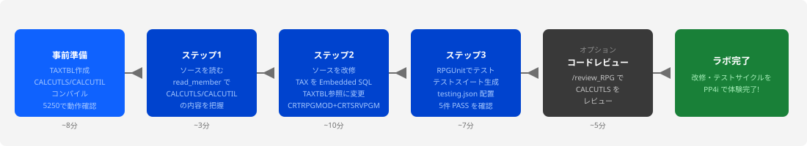
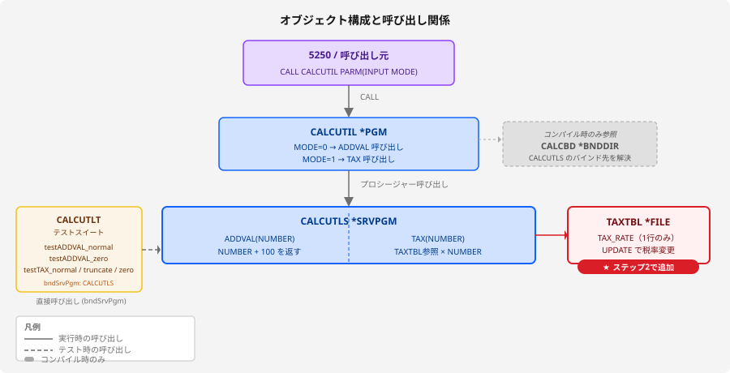

> 🚧 **このラボは現在作成中です。内容は予告なく変更される場合があります。**

# LAB2-PP4i: PP4iでソース改修・テストを体験 🔧

## 🎯 このラボの目標

PP4iを使って IBM i 上のRPGLEソースを**Bobへの自然言語指示で改修**し、**コンパイル**して**RPGUnitでテスト**する、一連の開発サイクルを体験します。

**所要時間**: 25-30分
**難易度**: ★★★☆☆（中級）
**使用モード**: IBM i Developer モード
**ワークスペース**: Library List

---

## 🗺️ このラボの全体の流れ



---

## 📚 学習内容

このラボでは、以下のスキルを習得します：

- ✅ `read_member` でIBM i からソースを直接読み込み
- ✅ Bobへの自然言語指示によるRPGLEソース改修
- ✅ `write_member` でIBM i のソースメンバーに直接保存
- ✅ Bobへの指示でコンパイルまで自動実行（`CRTRPGMOD`+`CRTSRVPGM` / `CRTBNDRPG` など）
- ✅ ILE の **サービスプログラム**・**バインディングディレクトリー**の概念（静的バインド = コンパイル時に呼び出し先を確定する仕組み）
- ✅ **データ駆動設計**：税率をテーブル（TAXTBL）で管理し、`READ` 命令で動的に取得
- ✅ **RPGUnit** によるユニットテストの生成と実行

---

## 📋 このラボで使うソース

このラボでは2本のRPGLEソースを使います。

### CALCUTLS（サービスプログラム）

計算ロジックを持つサービスプログラムです。`ADDVAL`・`TAX` の2つのプロシージャーを `EXPORT` します。

```rpgle
     H NOMAIN
     H*****************************************************************
     H* CALCUTLS - 計算ユーティリティ サービスプログラム
     H*****************************************************************
     P ADDVAL          B                   EXPORT
     D ADDVAL          PI             9S 0
     D  NUMBER                        9S 0 CONST
     C*
     C                   RETURN    NUMBER + 100
     P ADDVAL          E
     P TAX             B                   EXPORT
     D TAX             PI             9S 0
     D  NUMBER                        9S 0 CONST
     D  WORK           S             11P 1
     C*
     C                   EVAL      WORK = NUMBER * 1.1
     C                   RETURN    %INT(WORK)
     P TAX             E
```

> 💡 **パラメーター型は `9S 0`（ゾーン）を使用**: ゾーン型は5250の `CALL` コマンドから `PARM('000000100')` のように文字列で自然に渡せるため扱いやすいです。フリーフォームのテストスイートでは`zoned(9:0)` と記述します。

### CALCUTIL（メインプログラム）

`MODE` パラメーターで処理を分岐し、`CALCUTLS` のプロシージャーを呼び出すメインプログラムです。バインディングディレクトリー `CALCBD` 経由で `CALCUTLS` に静的バインドします。

```rpgle
     H DFTACTGRP(*NO) ACTGRP(*CALLER)
     H BNDDIR('STUDYxx/CALCBD')
     H*****************************************************************
     H* CALCUTIL - 計算ユーティリティ メインプログラム
     H*****************************************************************
     D* プロトタイプの定義（CALCUTLS のプロシージャー）
     D ADDVAL          PR             9S 0
     D  NUMBER                        9S 0 CONST
     D TAX             PR             9S 0
     D  NUMBER                        9S 0 CONST
     D* 変数の定義
     D RESULT          S              9S 0
     D INPUT           S              9S 0
     D MODE            S              1S 0
     C     *ENTRY        PLIST
     C                   PARM                    INPUT
     C                   PARM                    MODE
     C                   IF        MODE = 0
     C                   EVAL      RESULT = ADDVAL(INPUT)
     C                   ELSE
     C                   EVAL      RESULT = TAX(INPUT)
     C                   ENDIF
     C                   DSPLY                   RESULT
     C                   SETON                                        LR
     C                   RETURN
```

**オブジェクト構成と呼び出し関係**:



**ポイント**:
- `CALCUTLS`：`NOMAIN` + プロシージャーを `EXPORT` → RPGUnit から直接呼び出し可能
- `CALCUTIL`：分岐ロジックのみ。コンパイル時に `CALCBD` 経由で `CALCUTLS` の場所を確定する（= **静的バインド**）
- `CALCBD`：バインディングディレクトリー。`CALCUTLS`（サービスプログラム）を登録しておくオブジェクトで、`CALCUTIL` のコンパイル時にバインド先の解決に使われる。作成・登録は準備4のプロンプトで自動実行される
- `TAXTBL`：現在の税率を1行だけ持つ設定テーブル。`TAX_RATE` の値を更新するだけで税率を変更できる
- **改修は `CALCUTLS` だけ**：`CALCUTIL` の再コンパイルなしに計算ロジックを差し替えられる

> 💡 **静的バインドとは？**: `CRTBNDRPG`（コンパイル）のタイミングで `CALCUTIL` と `CALCUTLS` が結びつきます。実行時は直接プロシージャーを呼び出すため高速です。`CALCUTIL` を再コンパイルしなくても `CALCUTLS` の中身（計算ロジック）だけ差し替えられるのがサービスプログラムの特徴です。

---

## 🛠️ 事前準備: ソースの作成とコンパイル（8分）

### 準備1: ワークスペースを Library List に切り替え、ライブラリーリストを確認する

1. チャット入力欄の上部にある **New Task** をクリック
2. **「Library List」** を選択
3. 以下のライブラリーが含まれていることを確認

| ライブラリー | 用途 |
|------------|------|
| `STUDYxx` | ソースメンバーの格納先（`xx` は割り当てられた自分の番号） |
| `RPGUNIT` | RPGUnit テストフレームワーク |

> 💡 **`STUDYxx` について**: `xx` はハンズオン参加者ごとに割り当てられた番号です。例：`STUDY01`、`STUDY02` など。LAB1 で複製した自分の `STUDYxx` ライブラリーを使用します。

> ⚠️ **`RPGUNIT` がリストにない場合**: IBM i の接続設定（Library List）に `RPGUNIT` を追加してください。RPGUnit テスト（ステップ3）の実行時に必要です。

### 準備2: IBM i Developer モードを選択

- **チャットウィンドウ左下**のモード選択から **「IBM i Developer」** モードを選択

### 準備3: 消費税テーブル（TAXTBL）の作成とデータ投入

以下のプロンプトをBobに貼り付けてください（`xx` は自分の番号）：

```
STUDYxx ライブラリーに消費税テーブルを作成してデータを投入してください。

【1】以下の SQL でテーブルを作成
CREATE TABLE STUDYxx/TAXTBL (
  TAX_RATE    DECIMAL(5,4) NOT NULL
)

【2】以下の SQL でデータを投入
INSERT INTO STUDYxx/TAXTBL VALUES (0.1000)
```

> 💡 **TAXTBL の設計**: 現在の税率を1行だけ持つ1列構成です。TAX プロシージャーは `OPEN TAXTBL` → `READ TAXTBL` で税率を取得 → `CLOSE TAXTBL` します。税率変更は `UPDATE STUDYxx/TAXTBL SET TAX_RATE = 0.08` だけで完了し、`CALCUTLS` の再コンパイルは不要です。

> ✅ **確認**: テーブル作成とデータ投入が正常終了したことを確認してから次のステップへ進んでください。

### 準備4: ソースの作成・コンパイル・バインディングディレクトリーの設定

以下のプロンプトをそのままBobに貼り付けてください（`xx` は自分の番号）：

```
以下の手順をすべて実行してください。

【1】STUDYxx/QEOLRPGLE に CALCUTLS メンバーを作成して以下のソースを書き込み、
    モジュールを作成（CRTRPGMOD）してからサービスプログラム（CRTSRVPGM）を作成してください。
    CRTSRVPGM のパラメーター: EXPORT(*ALL) ACTGRP(*CALLER)

     H NOMAIN
     H*****************************************************************
     H* CALCUTLS - 計算ユーティリティ サービスプログラム
     H*****************************************************************
     P ADDVAL          B                   EXPORT
     D ADDVAL          PI             9S 0
     D  NUMBER                        9S 0 CONST
     C*
     C                   RETURN    NUMBER + 100
     P ADDVAL          E
     P TAX             B                   EXPORT
     D TAX             PI             9S 0
     D  NUMBER                        9S 0 CONST
     D  WORK           S             11S 1
     C*
     C                   EVAL      WORK = NUMBER * 1.1
     C                   RETURN    %INT(WORK)
     P TAX             E

【2】バインディングディレクトリー STUDYxx/CALCBD を作成し、
    CALCUTLS (*SRVPGM) を登録してください。

【3】STUDYxx/QEOLRPGLE に CALCUTIL メンバーを作成して以下のソースを書き込み、
    CRTBNDRPG でコンパイルしてください。

     H DFTACTGRP(*NO) ACTGRP(*CALLER)
     H BNDDIR('STUDYxx/CALCBD')
     H*****************************************************************
     H* CALCUTIL - 計算ユーティリティ メインプログラム
     H*****************************************************************
     D* プロトタイプの定義（CALCUTLS のプロシージャー）
     D ADDVAL          PR             9S 0
     D  NUMBER                        9S 0 CONST
     D TAX             PR             9S 0
     D  NUMBER                        9S 0 CONST
     D* 変数の定義
     D RESULT          S              9S 0
     D INPUT           S              9S 0
     D MODE            S              1S 0
     C     *ENTRY        PLIST
     C                   PARM                    INPUT
     C                   PARM                    MODE
     C                   IF        MODE = 0
     C                   EVAL      RESULT = ADDVAL(INPUT)
     C                   ELSE
     C                   EVAL      RESULT = TAX(INPUT)
     C                   ENDIF
     C                   DSPLY                   RESULT
     C                   SETON                                        LR
     C                   RETURN
```

**期待される動作**:
1. `write_member` で `CALCUTLS` ソースを書き込み
2. `CRTRPGMOD` → `CRTSRVPGM` で `*SRVPGM` 作成
3. `CRTBNDDIR` + `ADDBNDDIRE` でバインディングディレクトリー設定
4. `write_member` で `CALCUTIL` ソースを書き込み
5. `CRTBNDRPG` で `*PGM` 作成

> ✅ **確認**: すべて正常終了したことを確認してから次のステップへ進んでください。

### 準備5: 5250でプログラムを呼び出して動作確認する

コンパイルが完了したら、5250エミュレーターで以下を実行して動作を確認します（`xx` は自分の番号）：

**MODE=0: 加算モード（100 + 100 = 200）**
```
CALL PGM(STUDYxx/CALCUTIL) PARM('000000100' '0')
```
```
DSPLY  0000000200
```

**MODE=1: 消費税モード（1000 × 1.1 = 1100）**
```
CALL PGM(STUDYxx/CALCUTIL) PARM('000001000' '1')
```
```
DSPLY  0000001100
```

**MODE=1: 小数切り捨て確認（1050 × 1.1 = 1155）**
```
CALL PGM(STUDYxx/CALCUTIL) PARM('000001050' '1')
```
```
DSPLY  0000001155
```

> 💡 **ポイント**: 3番目のパターンで小数点以下が切り捨てられることを確認できます（1050 × 1.1 = 1155.0 → 1155）。

> ✅ **確認**: 3パターンすべて期待通りに表示されたことを確認してから次のステップへ進んでください。

---

## ステップ1: ソースを読んで内容を確認する（3分）

改修前に対象ソースの内容をBobに読み込ませ、現状を把握します。

以下のプロンプトをBobに貼り付けてください：

```
STUDYXX/QEOLRPGLE の CALCUTLS と CALCUTIL メンバーを読み込んで、
2つのプログラムの役割と関係を日本語で説明してください。
```

**期待される動作**:
1. `read_member` ツールが `CALCUTLS`・`CALCUTIL` を IBM i から直接取得
2. IBM i Developer モードのRPGスキルが解析
3. サービスプログラムとメインプログラムの役割・静的バインドの関係を日本語で説明

---

## ステップ2: ソースを改修する（10分）

`CALCUTLS` の `TAX` プロシージャーを改修します。
税率をハードコードするのではなく、**消費税テーブル（TAXTBL）から税率を READ 命令で取得する**実装に変えます。

以下のプロンプトをそのままBobに貼り付けてください：

```
STUDYXX/QEOLRPGLE/CALCUTLS.RPGLE を以下の仕様で改修して、
サービスプログラムの再作成（CRTRPGMOD → CRTSRVPGM）まで実施してください。
CRTSRVPGM のパラメーター: EXPORT(*ALL) ACTGRP(*CALLER)

【改修仕様】
TAX プロシージャーを以下のように変更する。

- 消費税率をハードコードするのではなく、STUDYxx/TAXTBL から
  READ 命令で TAX_RATE を1件読み込む
- F仕様書に TAXTBL を追加する（入力ファイル、フルオープン、USROPN）
- プロシージャー開始時に OPEN TAXTBL、READ TAXTBL で TAX_RATE を取得後に CLOSE TAXTBL する
- 読み込んだ TAX_RATE を NUMBER に掛けて %INT で小数切り捨てした値を返す
- ADDVAL プロシージャーはそのまま（NUMBER + 100 を返す）
```

**期待される動作**:
1. Bobが改修仕様を解析して `CALCUTLS` ソースを編集（F仕様・OPEN/READ/CLOSE 追加）
2. `write_member` ツールで IBM i のソースメンバーに直接書き戻し
3. `CRTRPGMOD` → `CRTSRVPGM` でサービスプログラムを再作成

> 💡 **ポイント**: `CALCUTIL`（`*PGM`）は変更不要です。税率は TAXTBL の `TAX_RATE` を `UPDATE` するだけで変更でき、`CALCUTLS` の再コンパイルは不要です。これが**データ駆動設計のメリット**です。

> ✅ **確認**: コンパイルが正常終了したことを確認してから次のステップへ進んでください。

### 動作確認（5250）

改修後、5250エミュレーターで以下を実行して動作を確認します（`xx` は自分の番号）：

**MODE=1: 消費税モード（TAXTBL の税率 10% → 1000 × 1.1 = 1100）**
```
CALL PGM(STUDYxx/CALCUTIL) PARM('000001000' '1')
```
```
DSPLY  0000001100
```

> 💡 **税率変更の確認**: TAXTBL の `TAX_RATE` を更新するだけで税率を変えられます。`CALCUTLS` の再コンパイルは不要です。
>
> ```sql
> UPDATE STUDYxx/TAXTBL SET TAX_RATE = 0.0800
> ```
>
> 上記を実行してから再度 CALL すると `DSPLY 0000000080`（1000 × 0.08 = 80）になります。

> ✅ **確認**: 期待通りに表示されたことを確認してから次のステップへ進んでください。

---

## ステップ3: RPGUnit でテストする（7分）

### 3.1 testing.json の配置をBobに依頼

> 💡 **testing.json とは？**
> RPGUnit がテストスイートをコンパイル・実行するときの設定ファイルです。
> `CALCUTLT`（テストスイート）は `CALCUTLS` のプロシージャーを直接呼び出しますが、そのためにはコンパイル時に `CALCUTLS` をバインドする必要があります。
> この設定を `QTESTSRC/TESTING` メンバー（JSON形式）に書いておくと、PP4i の `run_rpg_unit_test_suite` ツールが自動的に読み込んで使用します。
> **テストスイートを書き込む前に先に配置しておくのがポイントです。**

以下のプロンプトをBobに貼り付けてください：

```
STUDYxx/QTESTSRC に TESTING メンバーを作成して、
以下の内容を書き込んでください。

{
  "rpgunit": {
    "rucrtrpg": {
      "bndSrvPgm": ["STUDYxx/CALCUTLS"],
      "tgtCcsid": "*JOB",
      "dbgView": "*SOURCE",
      "rpgPpOpt": "*LVL2",
      "cOption": ["*EVENTF"]
    }
  },
  "codecov": {
    "module": ["CALCUTLS"]
  }
}
```

> 💡 **`bndSrvPgm`**: テストスイートのコンパイル時に `CALCUTLS` をバインドする指定です。これにより `ADDVAL`・`TAX` プロシージャーをテストから直接呼び出せます。

> ✅ **確認**: `TESTING` メンバーが作成されたことを確認してから次へ進んでください。

### 3.2 テストスイートの作成をBobに依頼

> 💡 **実際の開発では**: `CALCUTLS のRPGUnitテストスイートを作って実行してください` の一言だけで、Bobがソース読み込み→テスト生成→実行まで全自動でやってくれます。ここでは**学習目的**で手順を分割し、型指定や期待値を明示しています。

以下のプロンプトをBobに貼り付けてください：

```
STUDYXX/QEOLRPGLE の CALCUTLS に対する RPGUnit テストスイートを生成して、
STUDYxx/QTESTSRC/CALCUTLT に書き込んでください。
QTESTSRC ソースファイルがなければ RCDLEN(112) IGCDTA(*YES) で作成してください。
テストケースは以下の5件を含めてください：
- testADDVAL_normal : ADDVAL(100) → 200
- testADDVAL_zero   : ADDVAL(0)   → 100
- testTAX_normal    : TAX(1000)   → 1100
- testTAX_truncate  : TAX(1050)   → 1155
- testTAX_zero      : TAX(0)      → 0
パラメーターの型は zoned(9:0) を使用してください。
テストスイートの書き込みのみ行い、コンパイル・実行はしないでください。
```

**期待される動作**:
1. `read_member` で `CALCUTLS` を取得してプロシージャー定義を解析
2. `generate_rpg_unit_test_stub` でテストスタブを生成
3. 5件のテストケースを含むソースを `write_member` で書き込み（コンパイル・実行はしない）

### 3.3 テストの実行

```
STUDYXX/QTESTSRC の CALCUTLT テストスイートを実行してください。
```

**期待される動作**:
1. `run_rpg_unit_test_suite` ツールがテストをコンパイル・実行
2. 5件のテスト結果サマリーをチャットに表示

**テストケースと期待値（TAXTBL に税率 10% が登録されている前提）**:

| テストケース | 内容 | 期待値 | テストの種別 |
|------------|------|--------|-----------|
| `testADDVAL_normal` | ADDVAL(100) | 200 | 正常系 |
| `testADDVAL_zero` | ADDVAL(0) | 100 | 境界値（0入力） |
| `testTAX_normal` | TAX(1000) | 1100（1000×1.1） | 正常系（TAXTBL 参照） |
| `testTAX_truncate` | TAX(1050) | 1155（1050×1.1=1155.0 切り捨て） | 境界値（小数切り捨て） |
| `testTAX_zero` | TAX(0) | 0 | 境界値（0入力） |

> 💡 **テストケースの期待値について**: TAXTBL に `TAX_RATE = 0.1000`（10%）が登録されている前提の期待値です。事前準備3でデータを投入済みであることを確認してからテストを実行してください。

> ✅ **確認**: 5件すべてが **PASS** になることを確認してください。

---

## 🔍 オプション: コードレビューで改修ポイントを把握する（5分）

スラッシュコマンド `/review_RPG` を使って、Bobにコードレビューを依頼します。

```
/review_RPG
STUDYXX/QEOLRPGLE/CALCUTLS.RPGLE
```

> 💡 **ポイント**: `/review_RPG` はPP4iのスラッシュコマンドです。IBM i Developer モードで使えるコードレビュー専用の機能です。

---

## ✅ チェックポイント

このラボを完了したら、以下を確認してください：

- [ ] ワークスペースを Library List に切り替えられた
- [ ] TAXTBL テーブルを作成して税率データ（10%）を投入できた
- [ ] BobへのプロンプトでCALCUTLS（サービスプログラム）が作成できた
- [ ] バインディングディレクトリー CALCBD が作成され、CALCUTLS が追加できた（CALCUTIL のコンパイル時のバインド先解決に使われる）
- [ ] CALCUTIL（メインプログラム）がコンパイルできた
- [ ] 5250の CALL コマンドで3パターンの動作確認ができた
- [ ] `read_member` でソースを読み込み内容を把握できた
- [ ] TAX プロシージャーを READ 命令で TAXTBL 参照に改修・コンパイルできた
- [ ] `write_member` でIBM i に書き戻しできた
- [ ] `testing.json` を配置できた
- [ ] RPGUnit テストスイートを書き込みできた
- [ ] RPGUnit テストを実行して5件 **PASS** を確認できた
- [ ] （オプション）`/review_RPG` でコードレビューを実施した

---

## 💡 このラボで学んだこと

### PP4i の開発サイクル

```
read_member（ソース取得）
    ↓
Bob に改修を指示（自然言語）
    ↓
write_member（編集したソースを IBM i に保存）
    ↓
Bob がコンパイル
（CRTRPGMOD+CRTSRVPGM / CRTBNDRPG など状況に応じて自動選択）
    ↓
run_rpg_unit_test_suite（RPGUnit テスト実行）

※ /review_RPG（コードレビュー）はオプションで任意のタイミングで実行可能
```

### ILE プログラム構成の基礎

| オブジェクト | 種別 | 役割 |
|------------|------|------|
| `TAXTBL` | `*FILE` | 現在の税率（TAX_RATE）を1行で管理するテーブル |
| `CALCUTLS` | `*SRVPGM` | 計算ロジック（ADDVAL/TAX）を EXPORT。TAX は TAXTBL を READ で参照 |
| `CALCBD` | `*BNDDIR` | サービスプログラムを一元管理 |
| `CALCUTIL` | `*PGM` | 分岐ロジック・CALCBD 経由でCALCUTLS にバインド |
| `CALCUTLT` | `*SRVPGM`（テスト） | CALCUTLS のプロシージャーを直接テスト |

> 💡 **データ駆動設計のメリット**: 税率変更は `UPDATE TAXTBL SET TAX_RATE = 0.08` だけで対応可能。`CALCUTLS` の再コンパイルは不要です。

### Base Bob と PP4i の比較

| 作業 | Base Bob | PP4i |
|-----|---------|------|
| ソース取得 | 手動でコピー＆ペースト | `read_member` で自動取得 |
| コードレビュー | ソース貼り付けが必要 | `/review_RPG` で自動取得・分析 |
| ソース改修 | ローカルで編集 | チャットで指示→自動編集 |
| IBM i への反映 | 手動でアップロード | `write_member` で自動保存 |
| コンパイル | 手動でCLコマンド | Bobが状況に応じてCLコマンドを自動実行 |
| テスト実行 | 手動でRPGUnit起動 | `run_rpg_unit_test_suite` |

---

## 🎉 ラボ完了！

お疲れ様でした！PP4iを使ったRPGLEソースのレビュー・改修・テストサイクルを体験しました。

### 次のステップ

準備ができたら、次のラボに進みましょう：

👉 **[LAB3-PP4i: ワークフローとスラッシュコマンドで業務を効率化](./LAB3-PP4i.md)** - Business Rules 抽出・RPG Modernization などのワークフローを体験します

---

**前のページ**: [LAB1-PP4i](./LAB1-PP4i.md) | **次のページ**: [LAB3-PP4i](./LAB3-PP4i.md)
