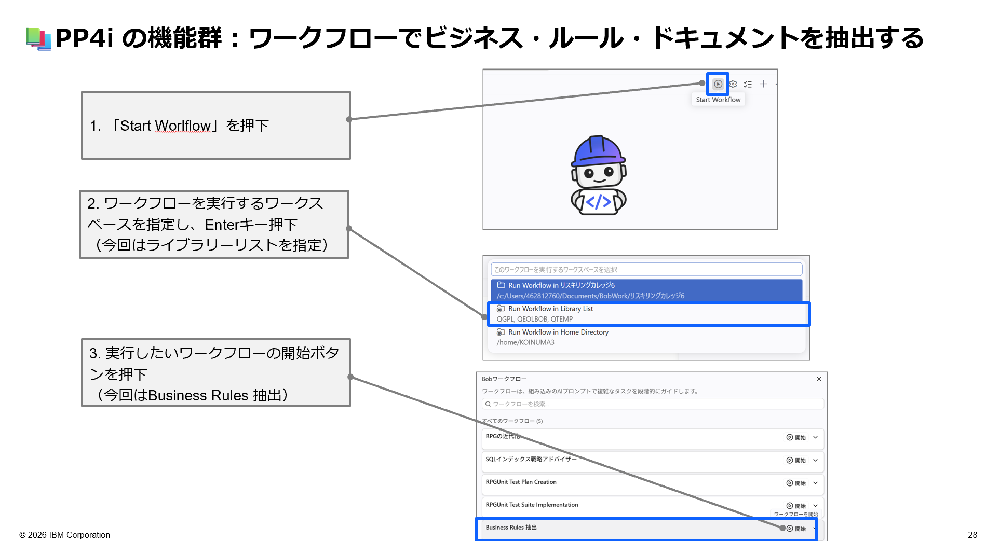
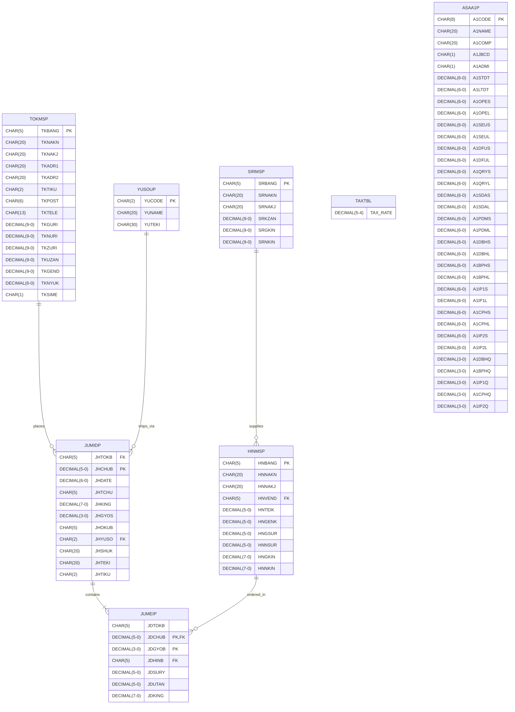

# LAB3-PP4i: PP4iワークフロー・スラッシュコマンドを体験 ⚙️

## 🎯 このラボの目標

PP4iが提供する**ワークフロー**と**/(スラッシュ)コマンド**を実際に動かして、IBM i 開発における複雑な作業の自動化を体験します。ビジネスルールの抽出、ERD生成、SQLレビューなど、実務で即活用できる機能を習得します。

**所要時間**: 15-20分
**難易度**: ★★★☆☆（中級）  
**使用モード**: IBM i Developer モード  
**ワークスペース**: Library List

---

## 📚 学習内容

このラボでは、以下のスキルを習得します：

- ✅ ワークフローの起動と操作方法
- ✅ **Business Rules 抽出ワークフロー**の実行
- ✅ **/(スラッシュ)コマンド**（`/erd`・`/review_SQL`）の活用
- ✅ ワークフローとスラッシュコマンドの使い分け

---

## ステップ1: 事前準備（3分）

### 1.1 ワークスペースを Library List に切り替える

このラボでは IBM i 上のソースを直接操作するため、ワークスペースを **Library List** に切り替えます。

1. チャット入力欄の上部にある **New Task** をクリック
2. **「Library List」** を選択
3. LAB1-PP4i で追加した `STUDYxx` ライブラリーが含まれていることを確認

> 💡 **LAB1-PP4iとの違い**: LAB1-PP4iではLocalワークスペースでHTMLを生成しました。このラボではIBM i 上のソースメンバーを直接読み書きするため Library List を使用します。

### 1.2 IBM i Developer モードを選択

1. **チャットウィンドウ左下**のモード選択から **「IBM i Developer」** モードを選択

---

## ステップ2: Business Rules 抽出ワークフローを実行（8分）

PP4iのワークフローを使って、既存RPGプログラムからビジネスルールを自動抽出します。

> 💡 **ワークフローとは？**  
> 複数のスキル・ツールを組み合わせて複雑なタスクを**手順通りに自動実行**するPP4i固有の機能です。「手順書を自動で実行してくれる仕組み」とイメージしてください。

### 2.1 ワークフローの起動


1. チャット画面の **「Start Workflow」** ボタンを押下

2. ワークフローを実行する**ワークスペースを指定**し、**Enter キー** を押下  
   - 今回は **Library List** を指定

3. 表示されるワークフロー一覧から **「Business Rules 抽出」** の開始ボタン（▶）を押下

### 2.2 抽出対象の指定

Bobから対象プログラムを聞かれたら以下を指定してください。
（他のソースメンバーを選んでいただいてもOKです）

```
STUDYxx/QEOLRPG の bch110 メンバー
```

### 2.3 抽出結果の確認

**期待される動作**:
1. `read_member` ツールが `bch110` を IBM i から直接取得
2. ビジネスルール（計算式・条件分岐・処理フロー）を自動解析
3. Markdown形式のドキュメントを生成・表示

**期待される回答のポイント**:
- 計算ルール（例：利用可能額 = 信用限度額 − 売掛金残高）
- ループ・条件分岐のロジック
- 入出力ファイルの役割
- エラー処理の有無

---

## 📐 ステップ3: /erdコマンドでERDを生成（5分）

スラッシュコマンドを使って、接続中のIBM i データベースのER図を自動生成します。

> 💡 **スラッシュコマンドとは？**  
> ワークフローほど複雑ではないが、よく使う作業をコマンド化したPP4i固有の機能です。`/` を入力するとコマンド一覧が表示されます。

### 3.1 /erdコマンドの実行

1. チャット入力欄で **`/erd`** と入力
2. コマンド一覧から `erd` を選択
3. 対象ライブラリー名を入力：

```
STUDYxx
```

**期待される出力（Mermaid ERD）**:



💡 **活用シーン**: 引き継ぎ資料・設計書にそのまま貼り付けて使えます。ドキュメント不足のシステムでも即座にDB全体像を把握できます。

---

## ステップ4: /review_SQLコマンドでSQLをレビュー（3分）

### 4.1 /review_SQLコマンドの実行

1. チャット入力欄で **`/review_SQL`** と入力
2. コマンド一覧から `review_SQL` を選択
3. 続けて以下のSQLを貼り付けて送信：

```sql
SELECT TKBANG, TKNAKJ, TKGEND, TKUZAN, (TKGEND - TKUZAN) AS RIYO
FROM STUDYxx/TOKMSP
WHERE TKUZAN > 0
ORDER BY TKUZAN DESC
```

**期待される回答のポイント**（事前定義のチェックリストに基づく）:
- ✅ **正確性**: SQLが意図した結果を返すか
- ✅ **パフォーマンス**: インデックスの活用・実行計画
- ✅ **セキュリティ**: リスクの有無
- ✅ **ベストプラクティス**: Db2 for i の推奨事項への準拠（`STUDYxx/TOKMSP` → `STUDYxx.TOKMSP` 形式など）

---

## 🔬 オプション: RPGユニットテストワークフローを体験（15分）

> ⏱️ **時間に余裕がある方向け**。LAB2-PP4iで作成した `CALCUTLS` サービスプログラムを使って、RPGUnitテストの計画・実装を**ワークフローで自動化**します。

PP4iには、テスト計画書の作成からテストコードの実装まで一気に行える2本のワークフローが用意されています。

### オプション A: RPGユニットテスト計画書の作成

1. **「Start Workflow」** ボタンを押下
2. ワークスペースに **Library List** を指定し、**Enter キー** を押下
3. ワークフロー一覧から **「RPGユニットテスト計画書の作成」** の開始ボタン（▶）を押下
4. 対象を聞かれたら以下を入力：

```
STUDYxx/QEOLRPGSRC の CALCUTLS メンバー
```

**期待される出力**:
- `CALCUTLS` がエクスポートするプロシージャー（`CalcTax` 等）の一覧
- 各プロシージャーに対するテストケースの計画（正常系・異常系・境界値）
- テストスイート構成の提案（Markdown形式）

### オプション B: RPGユニットテストスイートの実装

オプション A で生成したテスト計画書をもとに、実際のテストコードを自動生成します。

1. **「Start Workflow」** ボタンを押下
2. ワークスペースに **Library List** を指定し、**Enter キー** を押下
3. ワークフロー一覧から **「RPGユニットテストスイートの実装」** の開始ボタン（▶）を押下
4. Bobの指示に従って、オプション A で作成したテスト計画書を指定

**期待される動作**:
1. テスト計画書をもとにテストコード（`.test.rpgle`）を生成
2. テストスイートをコンパイル
3. テストを実行して結果を表示

> 💡 **ポイント**: テストの実行結果でエラーが出た場合も、そのままBobに「修正してください」と伝えるだけで対応できます。

---

## ✅ チェックポイント

このラボを完了したら、以下を確認してください：

- [ ] ワークスペースを Library List に切り替えられた
- [ ] Business Rules 抽出ワークフローを実行できた
- [ ] `/erd` コマンドでERDを生成できた
- [ ] `/review_SQL` コマンドでSQLをレビューできた
- [ ] ワークフローとスラッシュコマンドの違いを説明できる
- [ ] 🔬 （オプション）RPGユニットテスト計画書ワークフローを実行できた
- [ ] 🔬 （オプション）RPGユニットテストスイート実装ワークフローを実行できた

---

## 💡 このラボで学んだこと

### PP4iワークフロー・スラッシュコマンドでできたこと

✅ **複雑な作業を手順通りに自動化（ワークフロー）**
- 従来: 手動でソースを読み解き、ビジネスルールを一つひとつ文書化（数時間〜数日）
- PP4i活用: ワークフローを起動するだけでビジネスルール抽出を自動実行（数分）

✅ **よく使う作業をコマンド1つで実行（スラッシュコマンド）**
- `/erd` でDB全体のER図を即生成
- `/review_SQL` でSQLを包括的にレビュー

### ワークフローとスラッシュコマンドの使い分け

| | ワークフロー | スラッシュコマンド |
|--|------------|----------------|
| 複雑さ | 多段階・複雑なタスク | 比較的シンプルなタスク |
| 起動方法 | Start Workflow ボタン | `/` から入力 |
| 例 | Business Rules抽出 | /erd、/review_SQL |
| 対話 | Bobと対話しながら進む | 入力後すぐ結果が返る |

### PP4i全機能マップ（おさらい）

```
PP4i
├── スキル（自動適用） ← LAB1-PP4iで体験
│   └── RPG/DDS/CL/SQLの専門知識で精度向上
├── ツール（明示的に呼び出し可能） ← LAB1-PP4iで体験
│   └── read_member / write_member / execute_cl_command 等
├── RAG（IBM i 公式ドキュメント参照） ← LAB1-PP4iで体験
├── ワークフロー（Start Workflowから起動） ← このラボで体験
│   ├── Business Rules 抽出
│   ├── RPGユニットテスト計画書の作成（オプション）
│   └── RPGユニットテストスイートの実装（オプション）
└── /(スラッシュ)コマンド ← このラボで体験
    ├── /erd -> ERD生成
    └── /review_SQL -> SQLレビュー
```

### 実務での活用シーン

1. **引き継ぎ・ドキュメント整備**
   - Business Rules 抽出で既存システムを即座にドキュメント化
   - `/erd` で複雑なDB設計を可視化して後任者に引き継ぎ

2. **SQL品質向上**
   - `/review_SQL` でパフォーマンス問題を事前発見
   - Db2 for i のベストプラクティスへの準拠を確認

---

## 🎯 よくある質問

**Q: ワークフローの結果はどこに保存される？**

A: Library List ワークスペースの場合、書き込みは `write_member` ツールを通じてQSYSソースメンバーに直接行われます。

**Q: /erdで特定のテーブルだけ表示できる？**

A: `/erd` 実行後、Bobにテーブルを絞り込むよう指示することができます（例：「TOKMSPとJUMEIPのみのERDを生成してください」）。

---

## 🎉 ラボ完了！

お疲れ様でした！PP4iのワークフローとスラッシュコマンドを使った自動化を体験しました。

### このワークショップで学んだこと（まとめ）

| ラボ | 内容 | 習得スキル |
|-----|------|----------|
| LAB1 | 既存プログラムの理解 | Ask/Agentモード、コード解析、設計書生成 |
| LAB2 | プログラムの修正 | DDS/RPGの修正、影響分析 |
| LAB3-FIX | 新規プログラム作成 | RPG III固定形式の開発 |
| LAB1-PP4i | PP4i基本操作 | IBM i 接続、スキル/ツール/RAG、HTML設計書生成 |
| LAB2-PP4i | ソース改修・テスト | RPGソース改修、RPGUnit テスト |
| **LAB3-PP4i** | **ワークフロー・スラッシュコマンド** | **Business Rules抽出、ERD生成、SQLレビュー、RPGUnitテスト（オプション）** |

### 次のステップ

- 📖 [PP4i公式ドキュメント](https://bob.ibm.com/docs/ide/premium-packages/bob-for-i/workflows) でワークフローの詳細を確認
- 💡 [Qiitaサンプルプロンプト集](https://qiita.com/amogi23/items/fd91ddddf93057e562b5) で実践例を参考にする
- 🏗️ 自社システムのRulesとSkillsを作成して、チーム開発に活用する

---

**前のページ**: [LAB2-PP4i](./LAB2-PP4i.md) | **トップに戻る**: [README](./README.md)
